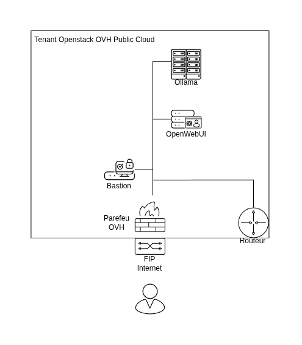

# OVH - OLLAMA - OPENWEBUI

[TOC]

## Description

Projet pour monter automatiquement une infrastructure pour installer ollama sur une instance OVH Public Cloud. Utile si on a pas les ressources physique en local.  
Sa configuration permet une évolution rapide, augmentation des ressources matériel, ajout de RAG, etc...  
Peut être utilisé pour une utilisation temporaire.

## Prérequis

## Utilisation

